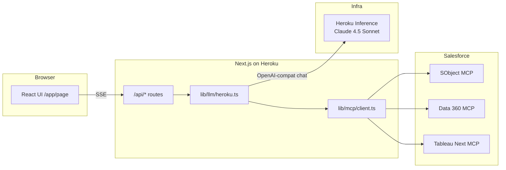
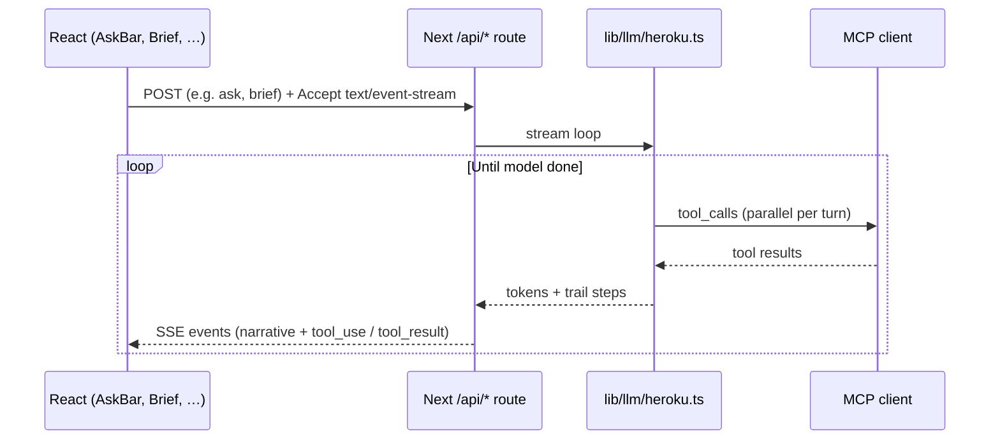
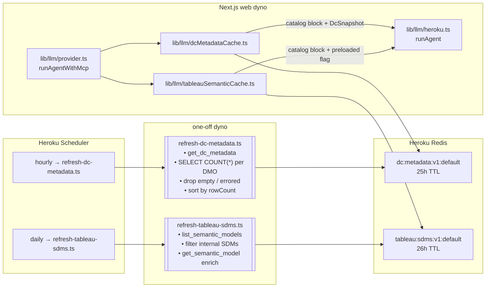

# Horizon — Architecture

Horizon is a single Next.js application deployed to Heroku. The browser never calls Salesforce MCP servers directly; the server-side agent loop orchestrates tools and streams results over SSE.

## Request flow

## SSE to the browser (reasoning trail + text)

The **reasoning trail** is a first-class product surface: bankers see which tools ran, including handled schema or SOQL errors, without raw tokens dumping stack traces into prose.

## MCP tool loop (conceptual)

1. The model receives flattened tool definitions (`salesforce_crm__*`, `data_360__*`, `tableau_next__*`, optional `heroku_toolkit__*`).
2. **Tool-list filtering** — when the metadata caches are populated (see below), `get_dc_metadata` and `list_semantic_models` are filtered from the model's tool array. The model sees only the authoritative discovery data in the system prompt plus the tools that do real work (`post_dc_query_sql`, `analyze_data`, `soqlQuery`, etc.).
3. The model emits `tool_calls`; the server dispatches them in parallel to the right MCP transport (Streamable HTTP for Salesforce-hosted servers).
4. **Hallucination rejection** — if the model emits a tool name that isn't in the pre-approved visible set (e.g. `$MCP_SERVER_DATA_360__get_dc_metadata` or any other invented prefix), dispatch is rejected synthetically before any network call, the circuit breaker trips for that key, and the model sees a clear "Unknown tool" payload on its next iteration.
5. Tool results are returned as `role: tool` messages; the loop repeats until the model finishes or iteration limits are hit.
6. The API forwards **text deltas** and **reasoning-trail steps** to the client as SSE events.

**Per-turn result cache** — within a single `runAgent` invocation, identical tool calls (same server + tool + args JSON) are deduplicated. Successes are cached and replayed with a `[cached]` suffix; failures are not cached (the circuit breaker already blocks repeat failures).

Runtime **constraints** on tool use (metadata-before-SQL, SOQL date literal spelling, Tableau model binding, etc.) are enforced in prompts (`lib/prompts/system.ts`) and, for some paths, in dispatch preflight. See [**LLM_PROMPT_GUIDE.md**](./LLM_PROMPT_GUIDE.md) for a contributor-oriented catalog of known failure modes.

## Metadata cache layer

Data Cloud DMO metadata (~1000 entries, ~5 MB raw) and Tableau Next semantic models change rarely but used to be discovered per-turn, wasting iterations and hitting truncation limits that let the model hallucinate DMO and column names. The metadata cache pre-computes these catalogs out-of-band and injects them into the system prompt.

**What the cache does on every turn:**

1. `runAgentWithMcp` reads both Redis entries in parallel.
2. Renders each envelope into a compact catalog block (DC: top 60 banker-relevant DMOs + 10 overflow, full fields on top 20; Tableau: 8 banker-relevant SDMs with dimensions + measurements) and appends them to the system prompt.
3. Passes `preloadedDcSnapshot` and `preloadedTableauSdms` into `runAgent`.
4. `runAgent` uses both signals to: pre-populate the DC SQL preflight's schema snapshot, mark the metadata-before-SQL gate as satisfied, and filter discovery tools out of the model's OpenAI function list.

**Graceful degradation:** if Redis is empty (e.g. first deploy, scheduler down for > TTL), `loadCachedDcMetadata()` returns null and the agent falls back to live-metadata-per-turn — the same pre-cache behavior the app shipped with. The scheduler TTLs (25h DC, 26h Tableau) are sized to tolerate one fully missed refresh cycle.

**Internal skip gate** — the DC refresh script fires hourly (Heroku Scheduler's smallest interval) but early-exits 11 of 12 runs via `DC_METADATA_MIN_AGE_HOURS` (default 12), so real work happens ~twice a day while the cache stays fresh.

See [OPERATIONS.md](./OPERATIONS.md#scheduled-jobs) for the Scheduler wiring and [LLM_PROMPT_GUIDE.md](./LLM_PROMPT_GUIDE.md#catalog-first-prompt-discipline) for the prompt-side contract.

## Key source locations

| Area | Path |
|------|------|
| Agent loop | `lib/llm/heroku.ts` |
| MCP client & transports | `lib/mcp/client.ts`, `lib/mcp/tools.ts` |
| Versioned prompts | `lib/prompts/*.ts` |
| Main surface | `app/page.tsx`, `components/horizon/*` |
| SSE agent helper (client) | `lib/client/useAgentStream.ts` |

## Salesforce auth

OAuth 2.1 + PKCE obtains a token with the `mcp_api` scope. That bearer token is passed into MCP sessions. Session cookies gate which API routes run with a live token (see `lib/salesforce/token.ts` and `/api/auth/*` patterns).

For deeper product constraints (no navigation rails, reasoning trail as a feature), refer to your team’s **Horizon build spec** if you maintain one locally (this repo’s `.gitignore` may exclude it). **Prompt and MCP hygiene** for engineering are summarized in [LLM_PROMPT_GUIDE.md](./LLM_PROMPT_GUIDE.md).
