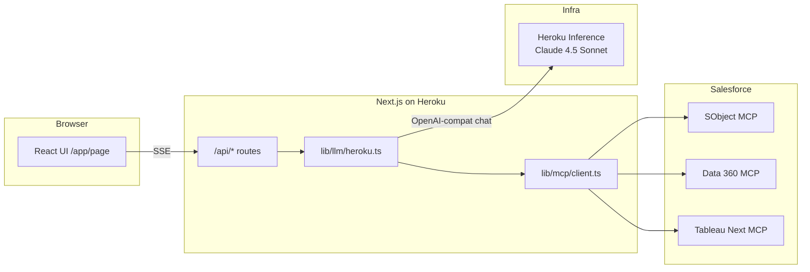

# Horizon — Architecture

Horizon is a single Next.js application deployed to Heroku. The browser never calls Salesforce MCP servers directly; the server-side agent loop orchestrates tools and streams results over SSE.

## Request flow

## MCP tool loop (conceptual)

1. The model receives flattened tool definitions (`salesforce_crm__*`, `data_360__*`, `tableau_next__*`, optional `heroku_toolkit__*`).
2. The model emits `tool_calls`; the server dispatches them in parallel to the right MCP transport (Streamable HTTP for Salesforce-hosted servers).
3. Tool results are returned as `role: tool` messages; the loop repeats until the model finishes or iteration limits are hit.
4. The API forwards **text deltas** and **reasoning-trail steps** to the client as SSE events.

## Key source locations

| Area | Path |
|------|------|
| Agent loop | `lib/llm/heroku.ts` |
| MCP client & transports | `lib/mcp/client.ts`, `lib/mcp/tools.ts` |
| Versioned prompts | `lib/prompts/*.ts` |
| Main surface | `app/page.tsx`, `components/horizon/*` |
| SSE agent helper (client) | `lib/client/useAgentStream.ts` |

## Salesforce auth

OAuth 2.1 + PKCE obtains a token with the `mcp_api` scope. That bearer token is passed into MCP sessions. Session cookies gate which API routes run with a live token (see `lib/salesforce/token.ts` and `/api/auth/*` patterns).

For deeper product constraints (no navigation rails, reasoning trail as a feature), refer to any internal **Horizon build spec** your team maintains separately from this public repo.
