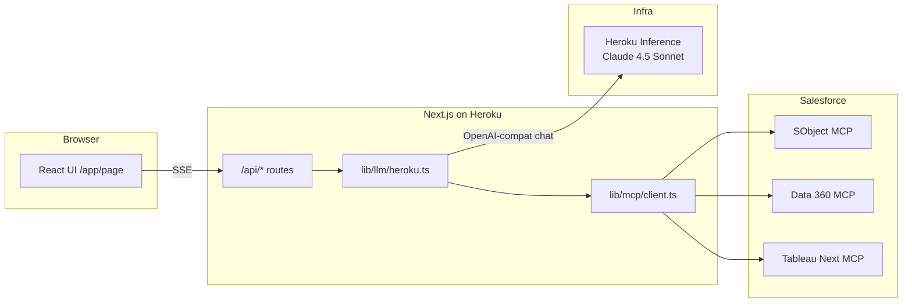
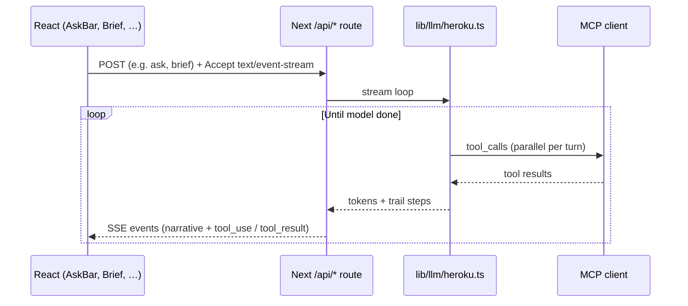
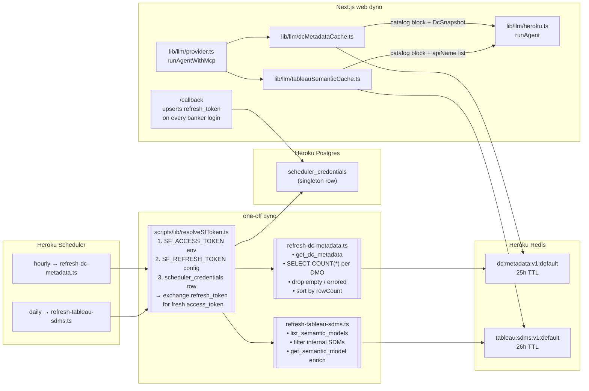

# Horizon — Architecture

Horizon is a single Next.js application deployed to Heroku. The browser never calls Salesforce MCP servers directly; the server-side agent loop orchestrates tools and streams results over SSE.

## Request flow

```mermaid
flowchart LR
  subgraph Browser
    UI[React UI /app/page]
  end
  subgraph Heroku["Next.js on Heroku"]
    API["/api/* routes"]
    Agent["lib/llm/heroku.ts"]
    MCP["lib/mcp/client.ts"]
  end
  subgraph Infra
    INF["Heroku Inference\nClaude 4.5 Sonnet"]
  end
  subgraph Salesforce
    CRM["SObject MCP"]
    DC["Data 360 MCP"]
    TN["Tableau Next MCP"]
  end
  UI -->|SSE| API
  API --> Agent
  Agent -->|OpenAI-compat chat| INF
  Agent --> MCP
  MCP --> CRM
  MCP --> DC
  MCP --> TN
```

## SSE to the browser (reasoning trail + text)

```mermaid
sequenceDiagram
  participant UI as React (AskBar, Brief, …)
  participant API as Next /api/* route
  participant Agent as lib/llm/heroku.ts
  participant MCP as MCP client
  UI->>API: POST (e.g. ask, brief) + Accept text/event-stream
  API->>Agent: stream loop
  loop Until model done
    Agent->>MCP: tool_calls (parallel per turn)
    MCP-->>Agent: tool results
    Agent-->>API: tokens + trail steps
    API-->>UI: SSE events (narrative + tool_use / tool_result)
  end
```

The **reasoning trail** is a first-class product surface: bankers see which tools ran, including handled schema or SOQL errors, without raw tokens dumping stack traces into prose.

## Three agent loops

Horizon runs three distinct agent loops, all implementing the same OpenAI-compat pattern but with independent prompts, tool sets, and hardening knobs:

| Loop | Model | File | Tool set | Surface |
|------|-------|------|----------|---------|
| Today | Claude 4.5 Sonnet | `lib/llm/heroku.ts` | all three SF MCPs + heroku toolkit | `/` |
| Ask My Data | Kimi K2 Thinking | `lib/inference/askDataAgent.ts` | first-party Data 360 only (2 tools) | `/ask-data` |
| Analyze | Kimi K2 Thinking | `lib/inference/analyzeAgent.ts` | first-party Tableau Next, 9 curated tools | `/analyze/[modelId]` |

All three share: per-iteration tool dedup, `<think>`-tag streaming stripper, circuit breaker with synthetic-guard shielding, fallback narrative on every silent-exit path, and `defaultExc` envelope unwrap at the MCP wrapper boundary (`lib/mcp/{client,firstPartyDataCloud}.ts`).

## MCP tool loop (conceptual)

1. The model receives flattened tool definitions (`salesforce_crm__*`, `data_360__*`, `tableau_next__*`, optional `heroku_toolkit__*`).
2. **Tool-list filtering** — when the metadata caches are populated (see below), `get_dc_metadata` and `list_semantic_models` are filtered from the model's tool array. The model sees only the authoritative discovery data in the system prompt plus the tools that do real work (`post_dc_query_sql`, `analyze_data`, `soqlQuery`, etc.).
3. The model emits `tool_calls`; the server dispatches them in parallel to the right MCP transport (Streamable HTTP for Salesforce-hosted servers).
4. **Hallucination rejection** — multi-layer:
   - **Tool name** — if the model emits a tool name that isn't in the pre-approved visible set (e.g. `$MCP_SERVER_DATA_360__get_dc_metadata` or any other invented prefix), dispatch is rejected synthetically before any network call, the circuit breaker trips for that key, and the model sees a clear "Unknown tool" payload on its next iteration.
   - **DC table + column** — `preflightDataCloudSql` checks every table and `__c`-suffixed column in the SQL against the cached DC snapshot. Unknown identifiers are rejected with the closest-matching real names quoted back to the model.
   - **Tableau SDM apiName** — `preflightTableauAnalyze` rejects `targetEntityIdOrApiName` values that aren't in the cached SDM apiName list. Tableau itself returns `INVALID_INPUT — don't have access` for unknown apiNames (misleading); local rejection surfaces the real list of valid apiNames in the model's next iteration.
5. **Duplicate suppression** — per-iteration (multiple calls to the same tool in one streamHeroku response collapse to one) AND turn-wide on budget-limited tools like `analyze_data` (same tool across iterations). Synthetic rejections carry `isSyntheticGuard: true` so they don't trip the MCP circuit breaker, which exists for infrastructure failures.
6. **Tool-choice forcing** (Analyze) — visualization follow-ups detected by regex (pronouns / chart-shape verbs / drill-downs) set `tool_choice: {type: "function", function: {name: "analyze_data"}}` on iteration 1 so Kimi can't answer "it's already rendered" in prose.
7. Tool results are returned as `role: tool` messages; the loop repeats until the model finishes or iteration limits are hit.
8. The API forwards **text deltas** and **reasoning-trail steps** to the client as SSE events.

**Turn-wide result cache** — within a single `runAgent` invocation, identical tool calls (same server + tool + args JSON) are deduplicated across ALL iterations. Cache lives at the turn level, not the iteration level (regressed once; re-fixed in commit `998def7`).

**MCP result unwrap** — Data Cloud wraps successful `post_dc_query_sql` payloads in `{"defaultExc": "<stringified JSON>", ...}`. Both `lib/mcp/client.ts` (Today) and `lib/mcp/firstPartyDataCloud.ts` (Ask My Data) unwrap this envelope before handing text to the agent so the model sees the actual `{data, metadata, responseCode}` shape.

Runtime **constraints** on tool use (metadata-before-SQL, SOQL date literal spelling, Tableau model binding, etc.) are enforced in prompts (`lib/prompts/system.ts`) and, for some paths, in dispatch preflight. See [**LLM_PROMPT_GUIDE.md**](./LLM_PROMPT_GUIDE.md) for a contributor-oriented catalog of known failure modes.

## Metadata cache layer

Data Cloud DMO metadata (~1000 entries, ~5 MB raw) and Tableau Next semantic models change rarely but used to be discovered per-turn, wasting iterations and hitting truncation limits that let the model hallucinate DMO and column names. The metadata cache pre-computes these catalogs out-of-band and injects them into the system prompt.

```mermaid
flowchart LR
  subgraph Scheduler["Heroku Scheduler"]
    CRON1["hourly → refresh-dc-metadata.ts"]
    CRON2["daily → refresh-tableau-sdms.ts"]
  end
  subgraph Refresh["one-off dyno"]
    RESOLVE[["scripts/lib/resolveSfToken.ts\n1. SF_ACCESS_TOKEN env\n2. SF_REFRESH_TOKEN config\n3. scheduler_credentials row\n→ exchange refresh_token\n  for fresh access_token"]]
    SCRIPT1[["refresh-dc-metadata.ts\n• get_dc_metadata\n• SELECT COUNT(*) per DMO\n• drop empty / errored\n• sort by rowCount"]]
    SCRIPT2[["refresh-tableau-sdms.ts\n• list_semantic_models\n• filter internal SDMs\n• get_semantic_model enrich"]]
  end
  subgraph Postgres["Heroku Postgres"]
    SC["scheduler_credentials\n(singleton row)"]
  end
  subgraph Redis["Heroku Redis"]
    K1["dc:metadata:v1:default\n25h TTL"]
    K2["tableau:sdms:v1:default\n26h TTL"]
  end
  subgraph Web["Next.js web dyno"]
    OAUTH["/callback\nupserts refresh_token\non every banker login"]
    Provider["lib/llm/provider.ts\nrunAgentWithMcp"]
    Cache1["lib/llm/dcMetadataCache.ts"]
    Cache2["lib/llm/tableauSemanticCache.ts"]
    Agent2["lib/llm/heroku.ts\nrunAgent"]
  end
  OAUTH --> SC
  CRON1 --> RESOLVE
  CRON2 --> RESOLVE
  RESOLVE --> SC
  RESOLVE --> SCRIPT1
  RESOLVE --> SCRIPT2
  SCRIPT1 --> K1
  SCRIPT2 --> K2
  Provider --> Cache1
  Provider --> Cache2
  Cache1 --> K1
  Cache2 --> K2
  Cache1 -->|catalog block + DcSnapshot| Agent2
  Cache2 -->|catalog block + apiName list| Agent2
```

**What the cache does on every turn (Today):**

1. `runAgentWithMcp` reads both Redis entries in parallel.
2. Renders each envelope into a compact catalog block (DC: top 60 banker-relevant DMOs + 10 overflow, full fields on top 20; Tableau: 8 banker-relevant SDMs with dimensions + measurements) and appends them to the system prompt.
3. Passes `preloadedDcSnapshot` and `preloadedTableauSdms` into `runAgent`.
4. `runAgent` uses both signals to: pre-populate the DC SQL preflight's schema snapshot, mark the metadata-before-SQL gate as satisfied, and filter discovery tools out of the model's OpenAI function list.

**What the cache does on every turn (Ask My Data):**

Same pattern, wired separately through `/api/ask-data/route.ts`. The formatter uses wider caps (`fullFieldsTopCount: 40`, `tailFieldsPerDmo: 30`) because Ask My Data asks more ad-hoc questions than Today and benefits from seeing more columns verbatim. `get_dc_metadata` is hidden via `preloadedDcMetadata: true` flag on the agent loop; when hidden, the model sees a clear "catalog already preloaded" error if it still tries to call it, not a generic "unknown tool" message.

**Pinned inclusion list** — some DMOs matter semantically even with low rowCount (life events are rare by design: one "home purchase" row is worth more than 10,000 routine transactions). `dcMetadataCache.ts` pins DMO name patterns (`ssot__PersonLifeEvent__dlm`, `PersonLifeEvent_Home__dll`, `/person.*life.*event/i`) that always land at the top of the catalog regardless of ranking. Easy to extend with KYC / fraud / AML patterns later.

**Graceful degradation:** if Redis is empty (e.g. first deploy, scheduler down for > TTL), `loadCachedDcMetadata()` returns null and the agent falls back to live-metadata-per-turn — the same pre-cache behavior the app shipped with. The scheduler TTLs (25h DC, 26h Tableau) are sized to tolerate one fully missed refresh cycle.

**Internal skip gate** — the DC refresh script fires hourly (Heroku Scheduler's smallest interval) but early-exits 11 of 12 runs via `DC_METADATA_MIN_AGE_HOURS` (default 12), so real work happens ~twice a day while the cache stays fresh.

**Scheduler authentication (`scripts/lib/resolveSfToken.ts`)** — the scheduler dyno can't sign in interactively, so refresh scripts resolve a fresh access token via this priority order:

1. `SF_ACCESS_TOKEN` env var (admin-route child process, or local dev with `.env`).
2. `SF_REFRESH_TOKEN` config var (designated service principal — set this for prod-grade rollout).
3. **`scheduler_credentials` singleton row** in Postgres (last-good banker login). Every successful `/callback` upserts the banker's `refresh_token` into this row; refresh scripts exchange it for a fresh access token via OAuth refresh-token grant. Self-heals on every banker login.

The schema migration that creates this table runs on every Heroku release (see `Procfile`'s `release: node scripts/apply-schema.cjs`). Migration is idempotent (`create table if not exists`) — release fails (rollback) if it errors.

**Dev refresh path** — local dev can avoid the `SF_ACCESS_TOKEN` env-var dance entirely by hitting `GET /api/admin/refresh-dc-cache?run=1&tool=dc|tableau|both&force=1` from an authenticated browser tab. The route spawns the refresh script as a child process, injecting the live banker session token. `redisSetOnce` opens a short-lived TLS connection for the final write, avoiding the "idle TLS socket severed" failure mode on Heroku Mini Redis.

See [OPERATIONS.md](./OPERATIONS.md#scheduled-jobs) for the Scheduler wiring and [LLM_PROMPT_GUIDE.md](./LLM_PROMPT_GUIDE.md#catalog-first-prompt-discipline) for the prompt-side contract.

## Key source locations

| Area | Path |
|------|------|
| Today agent loop | `lib/llm/heroku.ts` (+ `lib/llm/provider.ts` cache-aware wrapper) |
| Analyze agent loop | `lib/inference/analyzeAgent.ts` |
| Ask My Data agent loop | `lib/inference/askDataAgent.ts` |
| Inference tier router (Kimi / MiniMax / etc.) | `lib/inference/heroku.ts` |
| MCP client (Today, all 3 SF MCPs) | `lib/mcp/client.ts`, `lib/mcp/tools.ts` |
| MCP client (first-party DC for Ask My Data) | `lib/mcp/firstPartyDataCloud.ts` |
| MCP client (first-party Tableau Next for Analyze) | `lib/mcp/firstPartyTableauNext.ts` |
| Versioned prompts | `lib/prompts/*.ts` — each exports `*_PROMPT_VERSION` |
| Metadata caches (read side) | `lib/llm/dcMetadataCache.ts`, `lib/llm/tableauSemanticCache.ts` |
| Chart types + palette + sort helpers | `lib/analyze/{chartTypes,chartSelector,sortByDate,sanitize}.ts` |
| Surfaces | `app/(banker)/page.tsx` (Today), `app/(banker)/analyze/[modelId]/page.tsx` (Analyze), `app/(banker)/ask/[threadId]/page.tsx` (Ask My Data) |
| Section title chrome | `components/nav/SectionTopBar.tsx` (Ask My Data + Analyze) |
| SSE client hooks | `lib/client/{useAgentStream,useAnalyzeStream,useAskDataStream}.ts` |
| Scheduler auth | `scripts/lib/resolveSfToken.ts` (resolver) + `lib/db/schedulerCreds.ts` (Postgres helpers) |
| Release-phase migration | `scripts/apply-schema.cjs` (Procfile `release:` target) |

## Salesforce auth

OAuth 2.1 + PKCE obtains a token with the `mcp_api cdp_api refresh_token` scopes. That bearer token is passed into MCP sessions. Session cookies gate which API routes run with a live token (see `lib/salesforce/token.ts` and `/api/auth/*` patterns).

**Scheduler / unattended use** — refresh tokens issued during banker login are upserted into the `scheduler_credentials` singleton row in Postgres on every successful `/callback`. Refresh scripts exchange the stored refresh token for a fresh access token via OAuth refresh-token grant; see [OPERATIONS.md#scheduled-jobs](./OPERATIONS.md#scheduled-jobs) and `scripts/lib/resolveSfToken.ts`.

For deeper product constraints (no navigation rails, reasoning trail as a feature), refer to your team’s **Horizon build spec** if you maintain one locally (this repo’s `.gitignore` may exclude it). **Prompt and MCP hygiene** for engineering are summarized in [LLM_PROMPT_GUIDE.md](./LLM_PROMPT_GUIDE.md).
